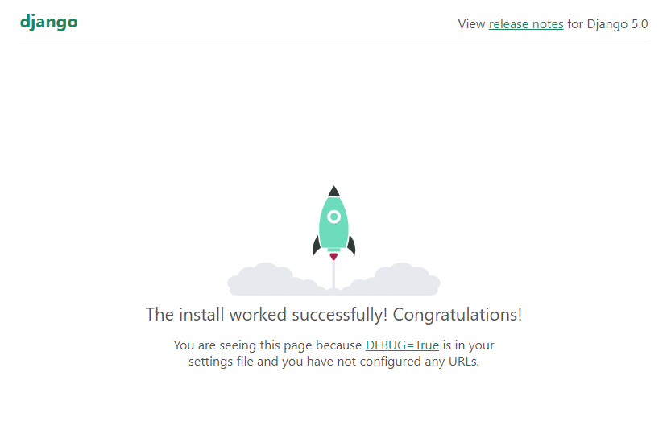
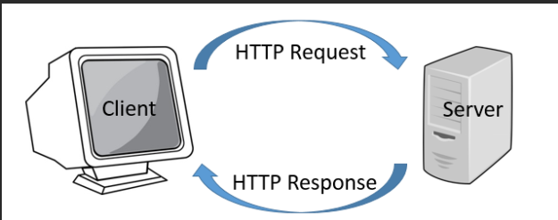

# Django
 My repository for course of Django
### Starting the project

```
django-admin startproject projeto .
```
- <b>django-admin:</b> Comand for call django admin
- <b>startproject:</b> Make the project
- <b>projeto</b>: Name of project
- <b> '.' </b>: Used so that the files are inside the project folder itself

### Server Executing
```
python manage.py runserver
```
- <b>runserver:</b> Runs the manage.py 

#### This is a server django runing

### Files

- <b>Db.sqlite3</b>: Database file
- <b>manage.py</b>: Django configuration file 
  #### Project Files
    - <b>pycache</b>: Python cache
    - <b> __init__.py</b>: Indicates of Python that folder is a module
    - <b> asgi.py and wsgi.py:</b> This files is using for communication with servers webs
    - <b>settings.py:</b> File settings 😃
    - <b>urls.py:</b> File used for create routes of application, is a address entered by the user in browser 

#### Creating routes 
To create a URL application, use the path function imported from Django. URL, this function receives one parameter, which is a request to the server.
#### HTTP protocol
The HTTP protocol is used for navigating the internet and is used to warrant security and integrity in message trading between the server and users.

The path is: the user does request and the server responds, this is a *REQUEST* and *RESPONSE*



### Creating App
For app Django we creating views that are the pages tha the users using for accessing the app, for a better organization we must creating apps for each pages used in app